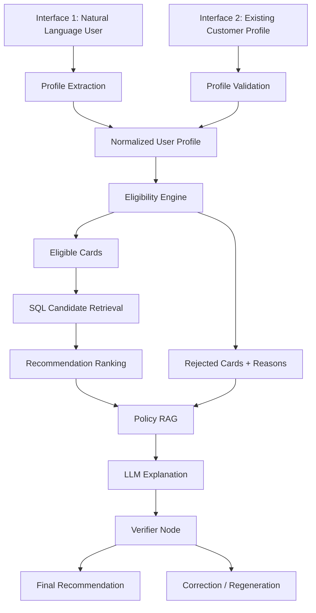
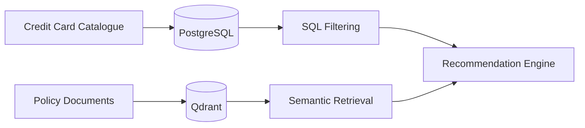
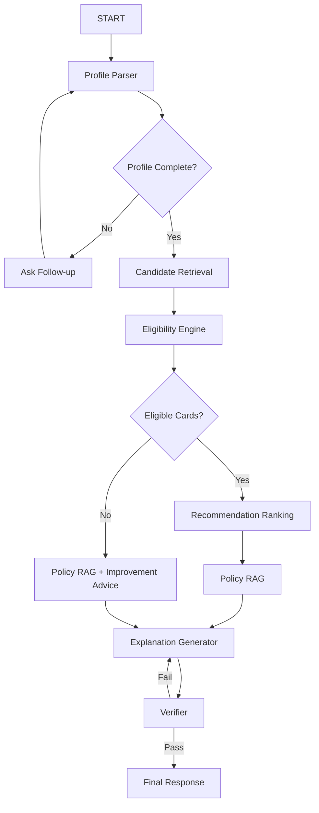
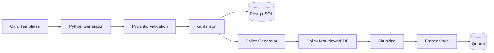
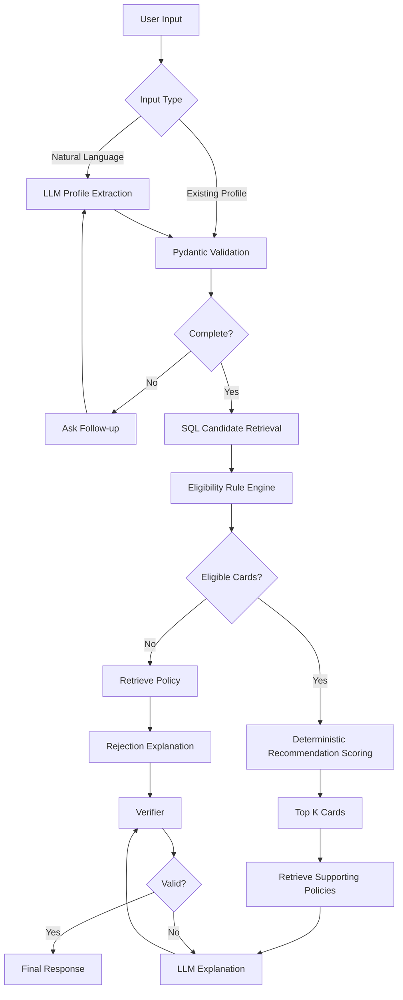

Yes, sir. Your understanding is now very close to the architecture I would actually submit.

I would **not** make this a generic “chat with an LLM and recommend a card” project. I would make it a **production-style credit-card decision and recommendation engine with an LLM interface**.

The core principle would be:

> **LLM handles understanding and explanation. Code handles eligibility. SQL handles candidate retrieval. RAG handles policy/evidence. A verifier checks the final answer.**

And because you don't have much time, I would **not add Jev or unnecessary multi-agent complexity**.

---

# 1. The final system I would build

You actually have **two entry points**, but they converge into the same recommendation pipeline.



Notice something important:

**RAG is not the primary database for cards.**

And:

**LLM does not determine eligibility.**

Those two decisions will make your system much more reliable.

---

# 2. Your two interfaces

## Interface A — Natural language

Example:

> "I'm 24, working as a software engineer in Bangalore. My salary is around 10 lakh. My credit score is 760. I spend mostly on travel, online shopping and dining. I don't want a card with a high annual fee."

LLM extracts:

```json
{
  "age": 24,
  "annual_income": 1000000,
  "employment_type": "salaried",
  "city": "Bangalore",
  "credit_score": 760,
  "spending": {
    "travel": 15000,
    "online_shopping": 12000,
    "dining": 6000,
    "fuel": 3000
  },
  "preferences": {
    "max_annual_fee": 2000,
    "preferred_categories": [
      "travel",
      "online_shopping",
      "dining"
    ]
  }
}
```

If important information is missing:

> "What is your approximate annual income?"

Then extraction happens again.

---

# 3. Interface B — Existing customer

The company already has:

```text
Customer ID
Age
Income
Credit score
Employment
Location
Monthly spending
Existing products
Preferences
```

No LLM extraction is required.

You directly validate the profile using Pydantic.

So:

```text
Natural language
       ↓
LLM
       ↓
Profile schema
       ↓
       ┐
       │
Existing profile
       ↓
Profile schema
```

Both eventually become the **same internal object**.

---

# 4. Pydantic should be the backbone

I would define strict schemas first.

Something like:

```python
from pydantic import BaseModel, Field
from typing import Optional, Literal


class SpendingProfile(BaseModel):
    travel: float = 0
    dining: float = 0
    fuel: float = 0
    groceries: float = 0
    online_shopping: float = 0
    offline_shopping: float = 0
    utilities: float = 0


class UserProfile(BaseModel):
    age: int = Field(ge=18, le=100)
    annual_income: float = Field(gt=0)
    employment_type: Literal[
        "salaried",
        "self_employed",
        "business_owner"
    ]

    city: str
    credit_score: int = Field(ge=300, le=900)

    spending: SpendingProfile

    max_annual_fee: Optional[float] = None

    preferred_categories: list[str] = []
```

Then card:

```python
class CreditCard(BaseModel):
    card_id: str
    issuer: str
    name: str

    min_age: int
    min_income: float
    min_credit_score: int

    eligible_employment_types: list[str]
    eligible_cities: list[str]

    annual_fee: float

    reward_rates: dict[str, float]

    benefits: list[str]

    reward_cap: Optional[float] = None
```

This gives you **schema validation everywhere**.

---

# 5. I would add an eligibility result schema

This is extremely useful.

```python
class EligibilityResult(BaseModel):
    card_id: str
    eligible: bool
    failed_rules: list[str] = []
    passed_rules: list[str] = []
```

Example:

```json
{
  "card_id": "CARD_021",
  "eligible": false,
  "failed_rules": [
    "Minimum income requirement is ₹12,00,000",
    "Applicant income is ₹9,00,000"
  ],
  "passed_rules": [
    "Age requirement satisfied",
    "Credit score requirement satisfied"
  ]
}
```

Now your frontend can show exactly **why a card failed**.

---

# 6. Where should credit cards live?

This is an important architecture decision.

## Don't put your entire card catalogue only inside RAG.

I would use:

### PostgreSQL → structured card catalogue

```text
cards
card_eligibility_rules
card_rewards
card_benefits
```

### Qdrant → unstructured policy documents

```text
terms and conditions
eligibility explanations
reward exclusions
fee waiver conditions
lounge conditions
FAQ
bank policy documents
```

So:



This is much better than embedding JSON card records into the vector database.

---

# 7. Why PostgreSQL for cards?

Suppose you have 5,000 cards.

You want:

> Find cards where minimum income <= user's income and credit score requirement <= user's score.

SQL is perfect.

```sql
SELECT *
FROM credit_cards
WHERE min_income <= :income
AND min_credit_score <= :credit_score
AND min_age <= :age;
```

You don't want an embedding model to decide this.

That's a database problem.

---

# 8. What RAG should actually do

RAG should answer things like:

> Why does this card require ₹10 lakh income?

> What is the annual fee waiver condition?

> Does the travel reward have a monthly cap?

> Why was this user rejected?

> What can the user do to become eligible?

So RAG is primarily your **policy/evidence layer**.

---

# 9. Eligibility should be card-by-card

You were correct about this.

Don't do:

```text
User → Eligible / Rejected
```

Instead:

```text
User
 ↓
Card A → Eligible
Card B → Rejected
Card C → Eligible
Card D → Rejected
Card E → Eligible
...
```

Because someone can be rejected for Card A but perfectly eligible for Card B.

---

# 10. But don't send 5,000 cards to the LLM

This is where SQL becomes important.

Suppose:

```text
5,000 cards
     ↓
SQL basic eligibility filter
     ↓
400 candidates
```

Then perhaps:

```text
400
 ↓
category / fee / geography filtering
 ↓
50
```

Then:

```text
50
 ↓
recommendation scoring
 ↓
Top 10
```

Only then do you use the LLM/RAG for deeper reasoning.

This saves:

- tokens
- latency
- cost
- context window
- irrelevant retrieval

---

# 11. But eligibility rules can be more complicated

Suppose:

```text
Card X:

Income >= ₹8L
AND
Credit score >= 750
AND
Age >= 21
AND
Employment = salaried
```

Easy.

But another card might have:

```text
Income >= ₹10L
AND
(
    city in supported cities
    OR
    existing relationship with bank
)
```

You need a rule engine.

I wouldn't introduce a huge external rule engine for this assignment.

Use Python.

---

# 12. Create a rule engine

For example:

```python
def check_card_eligibility(
    profile: UserProfile,
    card: CreditCard
) -> EligibilityResult:

    failed = []
    passed = []

    if profile.age >= card.min_age:
        passed.append("Minimum age satisfied")
    else:
        failed.append(
            f"Minimum age is {card.min_age}"
        )

    if profile.annual_income >= card.min_income:
        passed.append("Minimum income satisfied")
    else:
        failed.append(
            f"Minimum income is ₹{card.min_income}"
        )

    if profile.credit_score >= card.min_credit_score:
        passed.append("Credit score requirement satisfied")
    else:
        failed.append(
            f"Minimum credit score is {card.min_credit_score}"
        )

    return EligibilityResult(
        card_id=card.card_id,
        eligible=len(failed) == 0,
        failed_rules=failed,
        passed_rules=passed
    )
```

For the assignment, this is completely fine.

---

# 13. Then recommendation is a separate problem

Eligibility answers:

> **Can the user get the card?**

Recommendation answers:

> **Among cards the user can get, which ones fit the user best?**

Don't mix these.

That's an important conceptual distinction.

---

# 14. Recommendation score

I'd create a deterministic baseline scoring system.

For example:

```text
Recommendation Score

35% → spending-category match
25% → reward value
15% → annual-fee fit
15% → user preference match
10% → additional benefits
```

For example:

```python
score = (
    0.35 * spending_match +
    0.25 * reward_value +
    0.15 * fee_fit +
    0.15 * preference_match +
    0.10 * benefit_match
)
```

All components should be normalized between 0 and 1.

This is much easier to explain than:

> "The LLM thinks Card A is better."

---

# 15. Where does the LLM add value?

This is where your assignment becomes an **LLM application**, instead of a normal recommendation engine.

LLM does:

### 1. Natural-language profile extraction

### 2. Missing information detection

### 3. Intent/preference understanding

### 4. Explanation generation

### 5. Policy question answering

### 6. Conversational follow-up

The core financial/business rules remain deterministic.

---

# 16. Do we need LangGraph?

### Yes, I would use LangGraph.

But don't create 15 agents.

Use a small graph.



That's enough to demonstrate **agentic orchestration**.

---

# 17. What makes it agentic?

The agent can decide:

```text
Is profile complete?
        ↓
yes → retrieve cards

no → ask user
```

Then:

```text
Are there eligible cards?

yes → rank them

no → retrieve policy
      ↓
      explain rejection
      ↓
      suggest improvement
```

Then:

```text
Does final response have evidence?

yes → return

no → regenerate
```

That's genuine workflow orchestration.

You don't need fake:

> Agent 1 talks to Agent 2 talks to Agent 3...

---

# 18. Output schema

I would make the final output structured too.

```python
class Recommendation(BaseModel):
    card_id: str
    card_name: str
    score: float
    reasons: list[str]
    key_benefits: list[str]


class RejectionExplanation(BaseModel):
    card_id: str
    card_name: str
    reasons: list[str]
    improvement_actions: list[str]


class RecommendationResponse(BaseModel):
    status: Literal[
        "recommendations_available",
        "no_matching_cards",
        "need_more_information"
    ]

    recommendations: list[Recommendation]

    rejected_cards: list[RejectionExplanation]

    summary: str

    evidence: list[str]
```

This is extremely useful for frontend rendering.

---

# 19. Final verifier node

I would definitely include this.

Verifier checks:

### Eligibility consistency

```text
Did we recommend a card that failed eligibility?
```

### Evidence consistency

```text
Does every factual claim have supporting policy evidence?
```

### Hallucination

```text
Did the LLM invent a benefit?
```

### Numerical consistency

```text
Does annual fee match database?
```

### Ranking consistency

```text
Are recommendations actually eligible?
```

If failed:

```text
Verifier
   ↓
FAIL
   ↓
Regenerate explanation
```

---

# 20. Very important architecture detail

The verifier should **not independently decide eligibility**.

The source of truth should remain:

```text
PostgreSQL + Python Rule Engine
```

The verifier checks that the final generated response is consistent with those results.

---

# 21. Synthetic card catalogue

Since you don't have a real company's catalogue, yes, create a synthetic one.

But don't randomly ask an LLM:

> "Generate 500 credit cards."

That can create inconsistent data.

I would use a **controlled generation pipeline**.

---

# 22. Card catalogue generation

Use OpenCode to create a Python generator.

Give it a specification like:

```text
Generate a synthetic Indian credit-card catalogue for an
evaluation/demo system.

Generate 100-200 cards.

Use fictional banks and fictional card names.
Do NOT copy real financial products.

Every card must follow the Pydantic schema.

Create realistic but internally consistent:
- minimum income
- age requirements
- credit score requirements
- employment requirements
- annual fees
- reward categories
- reward rates
- reward caps
- benefits
- fee waiver conditions
- supported locations

Create multiple product segments:
- cashback
- travel
- fuel
- dining
- shopping
- premium
- beginner
- business
- lifestyle

Ensure some cards have strict eligibility and some have easy eligibility.

Output:
cards.json
```

Then validate with Pydantic.

---

# 23. Better: generate the catalogue hierarchically

Instead of:

```text
LLM → 200 cards
```

do:

```text
Card templates
      ↓
parameter generator
      ↓
deterministic Python generation
      ↓
Pydantic validation
      ↓
cards.json
      ↓
PostgreSQL
```

For example:

```text
Cashback template
Travel template
Fuel template
Premium template
Beginner template
```

Then Python generates variations.

That gives you **consistent synthetic data**.

---

# 24. Policy document generation

This is where your agentic coding workflow can help.

For every card generate a policy document:

```text
CARD_001_policy.md

# Card Name

## Eligibility

Minimum age:
Minimum income:
Minimum credit score:
Employment:

## Fees

Joining fee:
Annual fee:
Waiver condition:

## Rewards

Travel:
Dining:
Fuel:
Shopping:

## Restrictions

Reward cap:
Excluded transactions:
International transactions:

## Eligibility Improvement

Possible ways a customer may improve eligibility...
```

Then ingest these into Qdrant.

But make sure the policy is generated **from the same structured card data**.

Do not independently ask an LLM to invent policy.

Otherwise:

```text
Postgres says ₹8 lakh
Policy PDF says ₹10 lakh
```

and your system becomes inconsistent.

---

# 25. This is the pipeline I would use for synthetic data



The **structured card data is the source of truth**.

Policy documents are generated from it.

---

# 26. Synthetic user profiles

Same principle.

Create user archetypes.

For example:

```text
young_salaried_traveller
high_income_traveller
fuel_heavy_user
online_shopper
student
low_income_user
premium_customer
self_employed
business_owner
dining_heavy_user
```

Then generate variations.

Example:

```json
{
  "profile_id": "USER_001",
  "age": 25,
  "annual_income": 900000,
  "employment_type": "salaried",
  "credit_score": 760,
  "city": "Bangalore",
  "spending": {
    "travel": 15000,
    "dining": 8000,
    "fuel": 2000,
    "online_shopping": 12000
  },
  "max_annual_fee": 2000
}
```

---

# 27. But you need ground truth

This is crucial for evaluation.

For every synthetic profile, calculate expected results using **your deterministic rules**.

Example:

```text
USER_001

Eligible:
CARD_001
CARD_007
CARD_023

Rejected:
CARD_004 → income
CARD_009 → credit score
CARD_017 → age
```

Then expected ranking can be generated using your deterministic scoring formula.

Now you have:

```text
INPUT
GROUND TRUTH
SYSTEM OUTPUT
```

That's what allows evaluation.

---

# 28. Generate profiles using OpenCode

I'd give OpenCode this task:

```text
Build a synthetic dataset generator for the credit-card
recommendation system.

Requirements:

1. Read cards.json.
2. Read the Pydantic UserProfile schema.
3. Generate 500 synthetic user profiles.
4. Create diverse user archetypes.
5. Ensure edge cases:
   - income just below requirement
   - income exactly equal to requirement
   - credit score just below threshold
   - multiple eligible cards
   - no eligible cards
   - conflicting preferences
   - high income but low credit score
   - low income but high credit score
   - different spending patterns
6. For every profile, compute ground-truth eligibility.
7. Compute ground-truth ranking using the deterministic scoring engine.
8. Save:
   profiles.json
   evaluation_ground_truth.json
9. Validate everything with Pydantic.
```

This is much better than asking it to simply generate random JSON.

---

# 29. The database structure

I'd use PostgreSQL.

Something like:

```text
users
-----
profile_id
age
income
employment_type
city
credit_score
max_annual_fee


cards
-----
card_id
issuer
name
min_age
min_income
min_credit_score
annual_fee


card_rewards
------------
card_id
category
reward_rate
reward_cap


card_benefits
-------------
card_id
benefit
```

You don't need a massive normalized schema for an assignment.

Could even start with:

```text
cards
card_rewards
```

and expand only if needed.

---

# 30. RAG metadata

Each policy chunk should have metadata:

```json
{
  "card_id": "CARD_001",
  "document_type": "eligibility",
  "section": "income_requirement",
  "source": "CARD_001_policy.md"
}
```

Then you can filter Qdrant retrieval:

```text
card_id = CARD_001
```

This prevents retrieving irrelevant policies.

---

# 31. RAG pipeline

I'd use:

```text
Policy documents
      ↓
Markdown/PDF
      ↓
Recursive chunking
      ↓
Embeddings
      ↓
Qdrant
```

For retrieval:

```text
User/card context
      ↓
Query
      ↓
Qdrant
      ↓
Top relevant chunks
      ↓
LLM
```

---

# 32. Tech stack I'd choose

Given your existing experience:

### Backend

**Python + FastAPI**

### Agent orchestration

**LangGraph**

### LLM

Use whichever API your assignment permits.

You already have experience with Groq, so if allowed:

```text
Groq
 ↓
strong instruction-following model
```

Otherwise use an OpenAI-compatible provider.

### Structured output

**Pydantic**

### Database

**PostgreSQL**

### Vector DB

**Qdrant**

### Embeddings

Something lightweight like:

```text
all-MiniLM-L6-v2
```

or your permitted embedding API.

### Frontend

**Next.js/React**

### Deployment

```text
Frontend → Vercel
Backend → Render
PostgreSQL → Neon
Qdrant → Qdrant Cloud
```

That's a very reasonable portfolio/assignment deployment.

---

# 33. Don't over-engineer deployment

Your architecture can be:

```text
Vercel
   ↓
FastAPI
   ↓
LangGraph
   ├── PostgreSQL
   ├── Qdrant
   └── LLM API
```

Dockerize the backend.

Add:

```text
.env
Dockerfile
requirements.txt
```

And you're done.

---

# 34. Frontend

Yes — **definitely give profile options**.

Don't force the interviewer to type a perfect natural-language profile.

Have two tabs:

```text
┌─────────────────────────────────────┐
│ Credit Card Recommendation          │
│                                     │
│ [ Natural Language ] [ Profile ]    │
└─────────────────────────────────────┘
```

### Natural Language

Textarea:

> "I earn 12 lakh and spend mostly on travel..."

### Existing Profile

Form:

```text
Age                  [25]
Annual Income        [10,00,000]
Credit Score         [760]
Employment           [Salaried ▼]
City                 [Bangalore ▼]

Monthly Spending

Travel               [15,000]
Dining               [6,000]
Shopping              [12,000]
Fuel                  [3,000]

Maximum Annual Fee   [2,000]

[Recommend Cards]
```

This also makes your demo much easier.

---

# 35. Result UI

Show:

```text
Recommended Cards

🥇 Card A
Match Score: 91%

Why?
✓ Strong travel rewards
✓ Matches your dining spending
✓ Annual fee within preference
✓ You meet all eligibility criteria

---

🥈 Card C
Match Score: 84%

Why?
...
```

Then:

```text
Other Cards You Were Not Eligible For

Card B
✗ Income requirement: ₹12L
Your income: ₹10L

Card D
✗ Credit score requirement: 780
Your score: 760
```

And:

```text
How can you improve eligibility?

For Card D:
• Maintain/improve credit score
• Meet the card's published requirements
```

Be careful not to give questionable financial advice like:

> "Take a loan to increase your credit score."

Keep it generic and grounded in the policy.

---

# 36. The complete LangGraph state

Something like:

```python
class RecommendationState(TypedDict):

    user_profile: UserProfile | None

    profile_complete: bool

    candidate_cards: list[CreditCard]

    eligibility_results: list[EligibilityResult]

    eligible_cards: list[CreditCard]

    rejected_cards: list[RejectionExplanation]

    ranked_cards: list[Recommendation]

    policy_evidence: list[str]

    final_response: RecommendationResponse

    verification_passed: bool
```

---

# 37. Nodes

I'd implement exactly these:

```text
1. profile_parser
2. profile_validator
3. candidate_retriever
4. eligibility_checker
5. recommendation_ranker
6. policy_retriever
7. explanation_generator
8. verifier
```

That's enough.

---

# 38. Node responsibilities

### `profile_parser`

LLM → `UserProfile`

### `profile_validator`

Pydantic validation.

### `candidate_retriever`

SQL → candidate cards.

### `eligibility_checker`

Python rules → eligibility results.

### `recommendation_ranker`

Deterministic scoring → ranking.

### `policy_retriever`

Qdrant → supporting evidence.

### `explanation_generator`

LLM → natural language explanation.

### `verifier`

Checks everything.

---

# 39. One important improvement

I would **not necessarily run RAG for every card**.

Suppose:

```text
500 eligible cards
```

Don't retrieve policy for all 500.

First rank them.

```text
500
 ↓
ranking
 ↓
Top 10
 ↓
RAG
 ↓
Top 5
 ↓
LLM explanation
```

This significantly reduces latency.

---

# 40. Complete recommendation flow

Here's the flow I'd actually implement:



This is the architecture I'd submit.

---

# 41. Evaluation

You should evaluate **four different things**.

## A. Profile extraction

```text
Field extraction accuracy
```

Example:

```text
income: 95%
age: 99%
credit score: 98%
employment: 96%
```

---

## B. Eligibility

This is the most important.

```text
Eligibility Accuracy
Precision
Recall
F1
False Eligibility Rate
```

Especially:

> How often did the system recommend a card for which the user was actually ineligible?

That should be very low.

---

# 42. Recommendation evaluation

Use:

```text
Precision@K
Recall@K
NDCG@K
MRR
```

For example:

```text
Precision@3
NDCG@3
```

NDCG is especially useful because recommendation is a ranking problem.

---

# 43. RAG evaluation

Use:

```text
Context Precision
Context Recall
Faithfulness
Answer Relevance
```

If you already know **Ragas**, use it.

This gives you a proper RAG evaluation section.

---

# 44. LLM evaluation

Evaluate:

```text
Groundedness
Correctness
Completeness
No unsupported claims
```

You can use an LLM-as-judge for explanation quality, but don't use it as the source of truth for eligibility.

Your deterministic ground truth remains the authority.

---

# 45. Agent evaluation

Measure:

```text
Successful workflow completion
Correct tool selection
Invalid tool calls
Verifier failure rate
Average number of iterations
```

For example:

```text
100 test cases

96 → correct final recommendation
3 → verifier caught and regenerated
1 → failed
```

---

# 46. Latency

Track:

```text
profile extraction
SQL retrieval
eligibility checking
RAG
LLM generation
total latency
```

Use:

```text
p50
p95
```

---

# 47. What your README should show

I would structure the GitHub repo like this:

```text
credit-card-recommender/
│
├── backend/
│   ├── api/
│   ├── agents/
│   │   └── graph.py
│   ├── nodes/
│   ├── models/
│   │   └── schemas.py
│   ├── rules/
│   ├── retrieval/
│   ├── ranking/
│   ├── verification/
│   └── services/
│
├── data/
│   ├── cards.json
│   ├── profiles.json
│   └── policies/
│
├── evaluation/
│   ├── ground_truth.json
│   ├── evaluate.py
│   └── metrics.py
│
├── frontend/
│
├── scripts/
│   ├── generate_cards.py
│   ├── generate_profiles.py
│   └── ingest_policies.py
│
├── docker-compose.yml
├── README.md
└── .env.example
```

---

# 48. What I'd tell the interviewer

If they ask:

### "Why PostgreSQL and not RAG for cards?"

I'd say:

> "The card catalogue contains structured attributes such as minimum income, credit score, annual fee and reward rates. These are better queried deterministically using SQL. RAG is used for unstructured policy and terms information. This separation improves correctness, latency and explainability."

---

### "Why LLM if you already have rules?"

> "The LLM isn't responsible for deterministic business decisions. It handles natural-language profile extraction, understanding user preferences, conversational follow-ups and generating grounded explanations. The actual eligibility decision remains deterministic."

---

### "Why LangGraph?"

> "The workflow has conditional states: we may need more profile information, we may find no eligible cards, we may need policy retrieval, and the final response must pass verification. LangGraph gives us explicit state and controlled transitions rather than allowing an LLM to freely decide the workflow."

---

### "Why RAG?"

> "The structured database tells us what cards exist and their structured constraints. RAG gives the system access to detailed policy documents and provides evidence for explanations without putting the entire policy corpus into the prompt."

---

### "Why verifier?"

> "Because recommendation explanations are generated by an LLM. The verifier checks that the final response doesn't contradict deterministic eligibility results or make unsupported claims."

---

# 49. The most important design principle

Your system should have this hierarchy:

```text
                  TRUST LEVEL

              ┌────────────────┐
              │ Business Rules │  ← highest
              └───────┬────────┘
                      ↓
              ┌────────────────┐
              │   SQL Data     │
              └───────┬────────┘
                      ↓
              ┌────────────────┐
              │ Policy / RAG   │
              └───────┬────────┘
                      ↓
              ┌────────────────┐
              │      LLM       │
              └────────────────┘
```

The LLM should **never override the business rules**.

That's the key difference between a toy LLM demo and something I'd be comfortable submitting for an AI engineering interview.

---

# 50. And your final architecture in one sentence

I'd describe the project as:

> **"An agentic credit-card recommendation system that normalizes user profiles using an LLM, retrieves candidate products through structured SQL filtering, applies deterministic eligibility rules, ranks eligible products based on user spending and preferences, retrieves policy evidence through RAG, generates grounded explanations, and validates the final response through a verifier node."**

That's the project I would build.

### Next step

Before writing the actual LangGraph code, I would **freeze the data contracts first**:

1. `UserProfile`
2. `CreditCard`
3. `EligibilityRule`
4. `EligibilityResult`
5. `Recommendation`
6. `RecommendationResponse`
7. policy-document metadata

Then generate **~100 synthetic cards + ~500 synthetic profiles + their ground truth**, validate all of them with Pydantic, load cards into PostgreSQL and policies into Qdrant, and only then build the agent.

That prevents the common mistake of starting with LangGraph/LLM code before deciding what the system's data actually looks like.