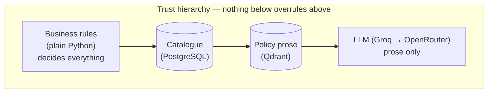
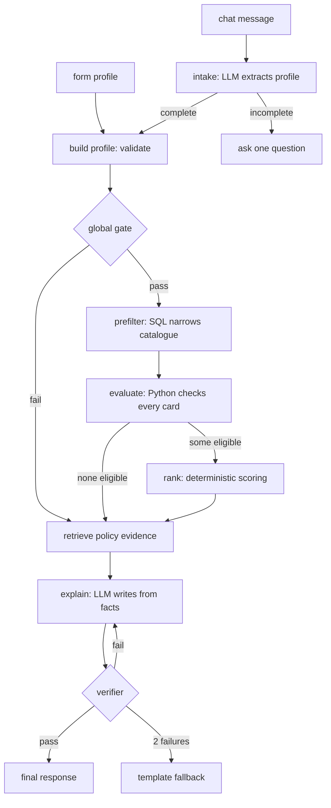
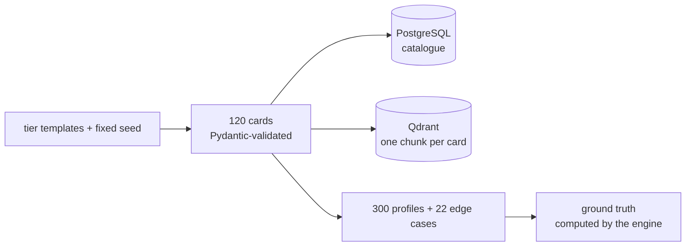

## trust

```mermaid
flowchart TD
    subgraph Trust["Trust hierarchy — nothing below overrules above"]
      RULES["Business rules<br/>(plain Python)<br/>decides everything"]
      DB[("Catalogue<br/>(PostgreSQL)")]
      RAG[("Policy prose<br/>(Qdrant)")]
      LLM["LLM (Groq → OpenRouter)<br/>prose only"]
      RULES --> DB --> RAG --> LLM
    end
```

## pipeline

```mermaid
flowchart TD
    A[chat message] --> I[intake: LLM extracts profile]
    F[form profile] --> G[build profile: validate]
    I -->|incomplete| Q[ask one question]
    I -->|complete| G
    G --> GATE{global gate}
    GATE -->|fail| EVID[evidence]
    GATE -->|pass| PRE[prefilter: SQL narrows catalogue]
    PRE --> EVA[evaluate: Python checks every card]
    EVA -->|none eligible| EVID
    EVA -->|some eligible| RANK[rank: deterministic scoring]
    RANK --> EVID[retrieve policy evidence]
    EVID --> EXP[explain: LLM writes from facts]
    EXP --> VER{verifier}
    VER -->|fail| EXP
    VER -->|pass| OUT[final response]
    VER -->|2 failures| TPL[template fallback]
```

## data

```mermaid
flowchart LR
    T[tier templates + fixed seed] --> C[120 cards<br/>Pydantic-validated]
    C --> PG[(PostgreSQL<br/>catalogue)]
    C --> QD[(Qdrant<br/>one chunk per card)]
    C --> P[300 profiles + 22 edge cases]
    P --> GT[ground truth<br/>computed by the engine]
```